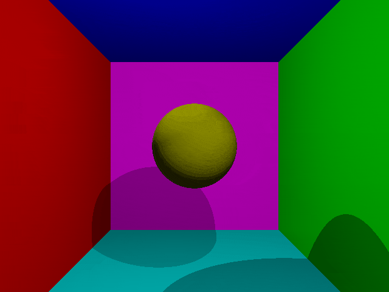

# Raymarch

A 3d renderer based on raymarching. Uses CUDA to accelerate renders.

<p align="center">
    
</p>

## Installation

- This program requires [`cuda`](https://developer.nvidia.com/cuda-toolkit) to be installed.
- Install python prerequisites with `pip install -r requirements.txt`. (`openCV` is only needed to display the frames)

## Usage

<p align="center">
    
    <br/>
    <i>Artifacts due to gif compression</i>
</p>

> Checkout `main.py` for the above animation.

### Scene

The scene is the main class that contains all the objects, light sources and the cameras in the scene. Example usage:

```py
scene = Scene(
    cameras={
        "primary": Camera(),
        "secondary": Camera(),
    },
    objects={
        "s": objects.Sphere([0, 0, 0], 1, color=[1, 1, 0]),
        "pl": objects.Plane([1, 0, 0], 4, color=[1, 0, 0]),
        "pr": objects.Plane([-1, 0, 0], 4, color=[0, 1, 0]),
        "pu": objects.Plane([0, -1, 0], 4, color=[0, 0, 1]),
        "pd": objects.Plane([0, 1, 0], 4, color=[0, 1, 1]),
        "pb": objects.Plane([0, 0, -1], 8, color=[1, 0, 1]),
        "l1": objects.PointLight([-1, 2, -2]),
        "l2": objects.PointLight([1, 2, -2]),
    },
)

scene.render() # Returns a dict of np.arrays. An entry for each camera.
```

#### Objects

There are three types of objects that can be placed in the scene: spheres, planes and point light sources.

#### Cameras

Cameras can be initialized with different parameters such as fov, aspect ratio and resolution. Multiple cameras can be within a same scene and `scene.render()` renders views from all cameras in the scene.

Transformations can be applied to the cameras in order to position them.

```py
from raymarch import Camera
from raymarch.utils import transformations as tf

main = Camera()

# Transformations can be stacked as follows:
t = tf.Transformation()
t = tf.Translate([0, 0, -8])(t)
t = tf.Rotate([3.14159/2, 0, 0])(t)

main.setMatrix(t)
```

> The camera transformation matrix is reset after each time render is called.
